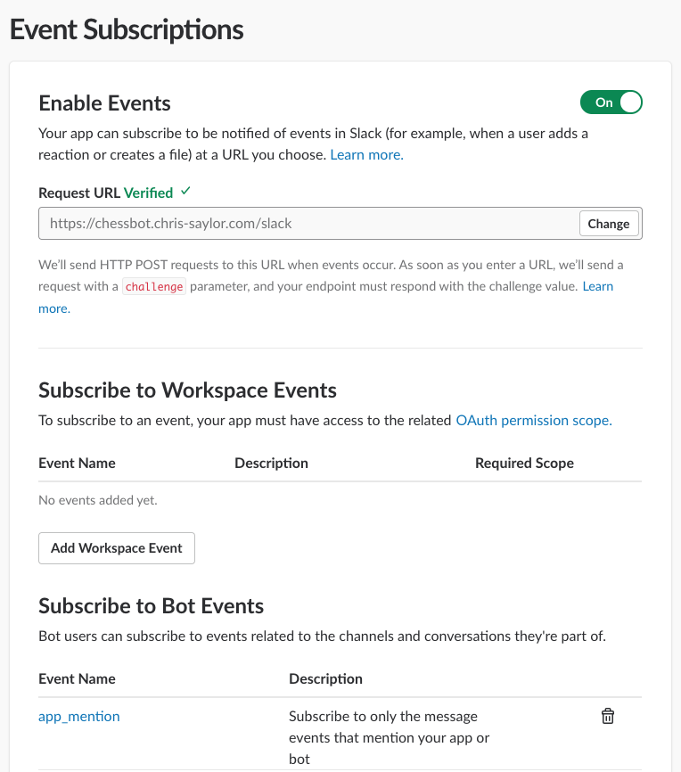
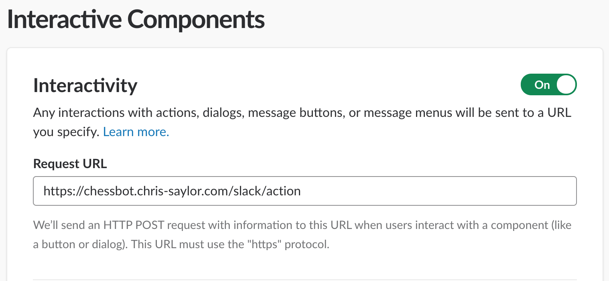

# ChessBot

[](https://drone1.chris-saylor.com/cjsaylor/chessbot)
[](https://godoc.org/github.com/cjsaylor/chessbot)
[](https://www.chris-saylor.com/chessbot)

This is a Slack bot that allows players to challenge each other to a game of Chess.


## Hosted Version

[](https://slack.com/oauth/authorize?client_id=4813578032.414983030853&scope=bot)

## Requirements

* Go `1.12` - Older versions will work, but `go mod` is being used to manage dependencies.

## Quick Start

```
cp .env.sample .env
export $(cat .env | xargs) && go run cmd/web/web.go
```

## Configuration

| Environment Variable | Default | Description
| --- | --- | ---
| PORT | `8080` | Port that the web server will listen
| HOSTNAME | `localhost:8080` | Used for generating links to render the game board state images
| SIGNINGKEY | N/A | Key used to sign the signature for board rendering URLs
| SQLITEPATH | N/A | Path to a sqlite3 database file. If not included, falls back to memory store.
| SLACKAPPID | N/A | The app ID that operates the slack bot.
| SLACKCLIENTID | N/A | Slack app client ID
| SLACKCLIENTSECRET | N/A | Slack app client secret
| SLACKSIGNINGKEY | N/A | Used to verify the request signature originates from slack

## Installing

```
https://slack.com/oauth/authorize?client_id=<client_id_here>&scope=bot
```

## Endpoints

```
GET /board?fen=&signature=&from=&to=&check=
```

Renders the game board based on the state of a game by FEN.

```
POST /slack
```

All slack event subscription callbacks flow through this.

* This is used for all typed commands mentioning `@ChessBot` in the channel.

```
POST /slack/action
```

All slack interactive component callbacks flow through this.

* This is used for accepting/rejecting challenges.

```
GET /slack/oauth
```

Slack app installation requests flow through here. A bot token is generated as part of the key exchange and stored keyed by team ID.

```
GET /analyze?game_id=
```

* This endpoint is used to generate an analysis of a game. It will redirect the user upon successful import to an analysis provider.

## Testing with Slack

In order to do end-to-end testing with Slack, you will need to use a service that exposes your environment to Slack to allow webhooks to enter your application.
I use [ngrok](https://ngrok.com/), but any local tunnelling software should work.

Because our application needs to know what the external hostname is, you'll need to start the tunneling service first to get a provided hostname from the service:

```bash
ngrok http 8080
```

The `8080` port is what we specify by default in `.env`.
Once the service is started and established, copy the hostname into `.env` for `HOSTNAME` environment variable, then start the application.

You will then need to enter the hostname into slack and allow them to prob your application with a challenge to ensure your app is authorized with the correct API tokens.



Finally, configure the interactive components to point to the action endpoint:



See the [Slack integration docs](./doc/slack_integration/README.md) for more info.

## Testing the Chess Engine

```
go run cmd/repl/main.go
```

```
λ go run cmd/repl/main.go
Game REPL
Note: piece colors may appear reversed on dark background terminals.
Game ID: jcghocxkvgakyefcjgsd

 A B C D E F G H
8♜ ♞ ♝ ♛ ♚ ♝ ♞ ♜
7♟ ♟ ♟ ♟ ♟ ♟ ♟ ♟
6- - - - - - - -
5- - - - - - - -
4- - - - - - - -
3- - - - - - - -
2♙ ♙ ♙ ♙ ♙ ♙ ♙ ♙
1♖ ♘ ♗ ♕ ♔ ♗ ♘ ♖

player2's turn (White)

> d2d4

 A B C D E F G H
8♜ ♞ ♝ ♛ ♚ ♝ ♞ ♜
7♟ ♟ ♟ ♟ ♟ ♟ ♟ ♟
6- - - - - - - -
5- - - - - - - -
4- - - ♙ - - - -
3- - - - - - - -
2♙ ♙ ♙ - ♙ ♙ ♙ ♙
1♖ ♘ ♗ ♕ ♔ ♗ ♘ ♖

player1's turn (Black)

> export
[Site "Slack ChessBot match"]
[White "player2"]
[Black "player1"]

1.d4 *

> fen
rnbqkbnr/pppppppp/8/8/3P4/8/PPP1PPPP/RNBQKBNR b KQkq d3 0 1

>
```

## Why not use Slack's RTM API?

1. We do not need realtime communication, webhooks perform perfectly fine for the asynchonous nature of Chess.
2. We have to implement a web server anyways for serving the game board as a PNG to be unfurled by Slack.
3. RTM messages don't support attachments.
