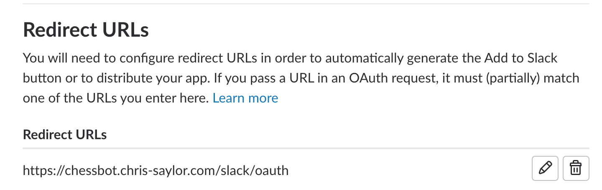

# Slack Bot Configuration

## App creation

* Create new app in desired workspace - https://api.slack.com/apps
* Create a bot user as part of the application (Under features)

## Setup event subscription

> Note: you will need a running webserver reachable by slack

## Setup interactive components

## Setup OAuth2 redirect URLs

The only scope necessary is bots as we only listen to and respond to app mentions.