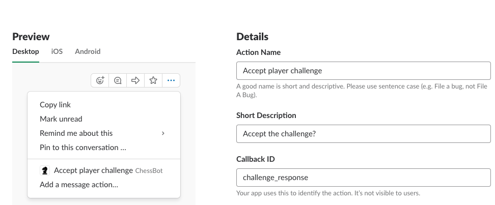

# Slack Bot Configuration

## App creation

* Create new app in desired workspace - https://api.slack.com/apps
* Create a bot user as part of the application (Under features)

## Setup event subscription

> Note: you will need a running webserver reachable by slack

## Setup custom actions

## Retrieve Tokens

* You'll need the bot oath token and verification token from the "basic details" area.