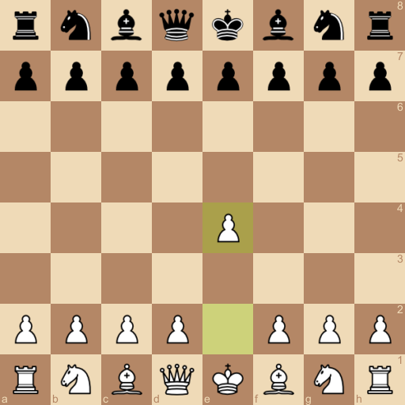
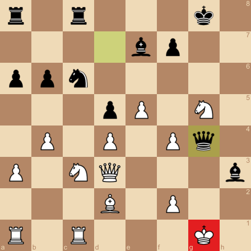

# chessimage

`chessimage` is a [golang](https://golang.org) library for rendering a chess board PNG in specific state.

[](https://godoc.org/github.com/cjsaylor/chessimage)


> `go run examples/starting_board.go | open -f -a /Applications/Preview.app/`

## Basic Usage

Include in your go path.

```bash
go get github.com/cjsaylor/chessimage
```

Initialize the renderer with a FEN notation.

```go
board, _ := chessimage.NewRendererFromFEN("rnbqkbnr/pppppppp/8/8/8/8/PPPPPPPP/RNBQKBNR w KQkq - 0 1")
```

Render the chess board to a png `image.Image` interface.

```go
f, _ := os.Create("board.png")
defer f.Close()
image, _ := board.Render(chessimage.Options{AssetPath: "./assets/")})
png.Encode(f, image)
```

## Highlighting LastMove

You can highlight tiles of where a move started and ended.

```go
board.SetLastMove(chessimage.LastMove{
	From: chessimage.E4,
	To: chessimage.E2,
})
```

[Example](./blob/master/examples/board_with_moves.go)



## Mark Checked

You can highlight a tile as "checked".

```go
board.SetCheckTile(chessimage.G1)
```

[Example](./blob/master/examples/king_checked.go)



## Options

You can define rendering options at render time:

```go
options := chessimage.Options{
	AssetPath: "./assets/"
}
renderer.Render(options)
```

#### AssetPath (**Required**)

Specify the path of the image assets for the individual pieces. Feel free to use the assets packaged in this repo, but be aware they are under CC license.

#### Resizer (`draw.CatmullRom`)

Change the algorhythm for asset resizing. Depending on your performance requirements, you may need to use a faster (but more lossy) resizing method (like `draw.NearestNeighbor`).

#### BoardSize (`512`)

Square board size in pixels

#### PieceRatio (`0.8`)

Size of the pieces relative as a percentage to the game board tile size. If the game board size is `800`, each board tile would be `100` pixels wide, and the pieces would render at `80` pixels with the default ratio.

## Todo

* Add support for `PGN` notation for rendering a board (similar to the `FEN` notation setup now)
* Add configuration support for changing board and tile highlight colors